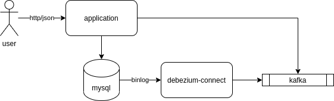

# Debezium CDC Kafka

Essa é uma POC para testes do Debezium utilizado como CDC para stream de eventos no MYSQL.

O Debezium é uma ferramenta CDC utilizado para stream de eventos em bancos de dados e publicação em tópicos do Kafka.

Funciona através da leitura de binlog gerado pelo banco de dados. O Debezium monitora os arquivos de binlog gerados e publica todas as transações em tópicos do Kafka.

É possível filtrar quais banco de dados e tabelas deverão ser monitorados, publicando apenas os eventos necessários (arquivo de configuração: connector-config.json).

No exemplo foi desenvolvido uma API REST que é um CRUD para operações na tabela products do banco MYSQL. A cada operação de inclusão, alteração ou exclusão, é gerado um evento no Kafka informando a transação realizada no banco de dados.



Para mais informações sobre o Debezium: https://debezium.io/documentation/reference/

## Stack

Tecnologia                       |  Versão       |
---------------------------------|---------------|
jdk                              | 11
kotlin                           | 1.4
spring-boot                      | 2.4.0
spring-cloud                     | 2020.0.0-M4
spring-cloud-stream-kafka-binder | 2020.0.0-M4
map-struct                       | 1.4.0.Beta3
mysql-connector-java             | 8.0.22
gradle-plugin-avro               | 0.9.1

## Dependências

* jdk11
* docker
* docker-compose

## Instalação

* Suba as dependências da aplicação: ``` docker-compose up -d```
* Verifique se ocorreu a subida de todas as dependências do docker-compose (verificar no log se o script do banco foi executado com sucesso)
* Execute o script para configuração do connector no debezium: ```./configurecdc.sh```
* Faça o build do projeto: ``` ./gradlew build ```
* Rode a aplicação: ``` ./gradlew bootRun ```

## Execução

Utilize a interface do swagger (http://localhost:8080/swagger-ui.html) para executar operações na tabela de produtos. Não esqueça de monitorar o log da aplicação para verificar as mensagens consumidas do tópico logo após cada operação de INSERT/UPDATE/DELETE via API.

A aplicação logará sempre que uma mensagem de evento do kafka (gerado pelo debezium) for consumida ``` grep 'Kafka stream event received:' ```
